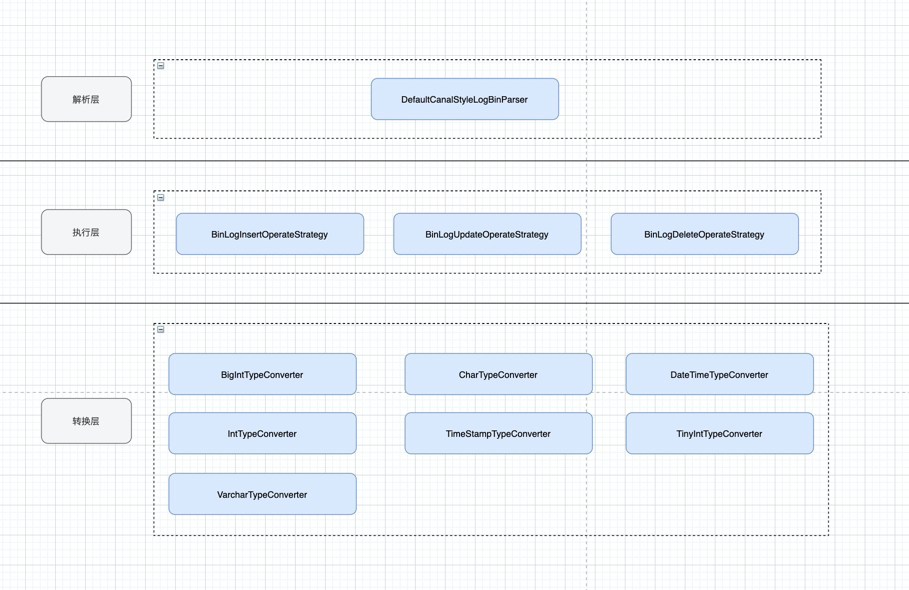

# bin-log-record-parse

## 1. 业务场景
在现有的业务场景下需要解析由中间件解析后的big log记录，转换为业务所需要的数据格式；
目前支持通用的Map格式数据；指定类型支持但是未经过测试；

## 2. 分层设计

### 3. 常见问题
#### 1. 导入后SpringBoot无法加载的问题
###### 当前包目录层级较高，如若加载不到请修改启动的的@SpringApplication(scanBasePackages = {your.package, "com.xfw.logbin"})